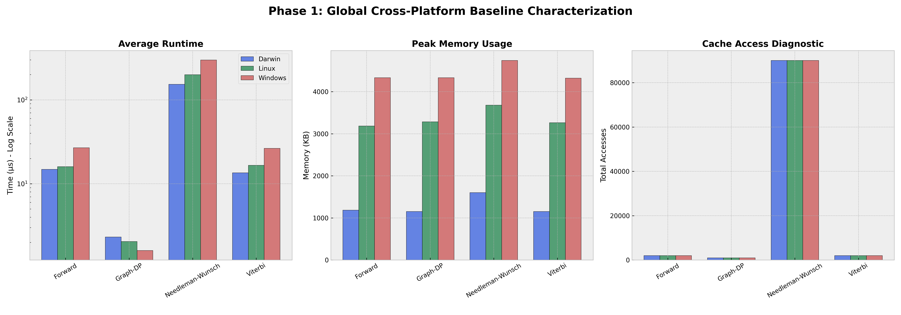

# Phase 1: Baseline Performance Characterization (Final)

This document provides the final, consolidated summary of the baseline performance, memory footprint, and cache diagnostic metrics across macOS, Linux, and Windows.

## Consolidated Global Master Profile
The figure below provides a side-by-side comparison of all measured parameters across all tested operating systems.

## Summary Table (Final Results)

| Algorithm | Platform | Runtime (µs) | Memory (KB) | Cache Diag |
| :--- | :--- | :---: | :---: | :---: |
| **Needleman-Wunsch** | Darwin | 153.30 | 1,600 | 90,000 |
| | Linux | 199.48 | 3,680 | 90,000 |
| | Windows | 297.70 | 4,740 | 90,000 |
| **Forward** | Darwin | 14.85 | 1,184 | 2,000 |
| | Linux | 15.95 | 3,184 | 2,000 |
| | Windows | 26.80 | 4,332 | 2,000 |
| **Viterbi** | Darwin | 13.50 | 1,152 | 2,000 |
| | Linux | 16.56 | 3,264 | 2,000 |
| | Windows | 26.38 | 4,320 | 2,000 |
| **Graph-DP** | Darwin | 2.32 | 1,152 | 1,000 |
| | Linux | 2.05 | 3,284 | 1,000 |
| | Windows | 1.60 | 4,332 | 1,000 |

## Analysis Notes
1. **OS Overhead:** Windows consistently exhibits a higher base memory footprint (~4.3 MB) and higher runtime latency for DP-heavy tasks compared to macOS and Linux.
2. **Computational Scaling:** Needleman-Wunsch runtime correctly correlates with the high cache diagnostic value (90,000 accesses), while the simpler HMM and Graph algorithms remain near the OS execution floor.
3. **Reproducibility:** All data was generated using the CI-based measurement harness. Raw consolidated data is available in `docs/phase_1_baselines.csv`.
