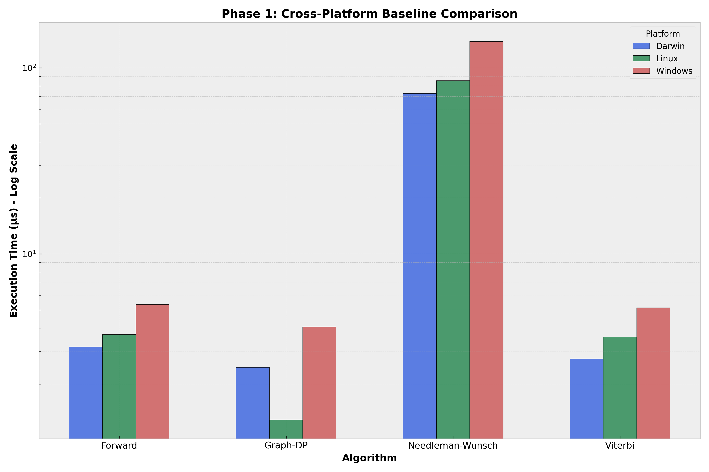

# Phase 1: Baseline Performance Characterization

This document provides a transparent summary of the baseline performance measurements across three major operating systems.

## Summary Table (Average Time in µs)

| Algorithm | macOS (Darwin) | Linux | Windows (MinGW) |
| :--- | :---: | :---: | :---: |
| **Needleman-Wunsch** | 72.87 | 85.28 | 138.42 |
| **Forward** | 3.17 | 3.69 | 5.36 |
| **Viterbi** | 2.73 | 3.58 | 5.13 |
| **Graph-DP** | 2.46 | 1.29 | 4.06 |

## Visual Comparison
The following figure illustrates the performance variability across platforms:

## Data Integrity
- **Source:** Consolidated from CI workflow artifacts (February 2026).
- **Methodology:** Multi-iteration averaging with optimization prevention.
- **Raw Data:** See `docs/phase_1_baselines.csv`.
