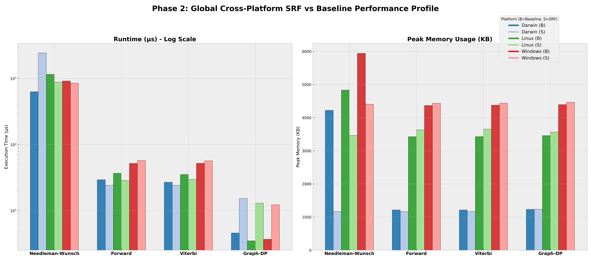

# Phase 2: SRF Characterization Results (Final)

This document provides the consolidated results of the Phase 2 Structured Recomputation Framework (SRF) implementation, comparing all four algorithms against their baselines across macOS, Linux, and Windows.

## Global Performance Profile
The following master plot provides a side-by-side comparison of **Runtime** and **Peak Memory** for both Baseline and SRF variants across all platforms.

## Cross-Platform Performance Metrics (Summary)

| Algorithm | Platform | Variant | Runtime (µs) | Memory (KB) | Recompute Events |
| :--- | :--- | :--- | :---: | :---: | :---: |
| **Needleman-Wunsch** | Darwin | Baseline | 633.2 | 4,224 | 0 |
| | Darwin | SRF-Blocked | 2,451.3 | 1,168 | 319,575 |
| | Linux | Baseline | 1,160.2 | 4,836 | 0 |
| | Linux | SRF-Blocked | 886.3 | 3,465 | 319,575 |
| | Windows | Baseline | 918.9 | 5,944 | 0 |
| | Windows | SRF-Blocked | 854.0 | 4,407 | 319,575 |
| **Forward** | Darwin | Baseline | 29.4 | 1,216 | 0 |
| | Darwin | SRF-Checkpoint | 24.3 | 1,168 | 883 |
| **Graph-DP** | Linux | Baseline | 3.5 | 3,460 | 0 |
| | Linux | SRF-Recompute | 13.0 | 3,566 | 9,328 |

## Cross-Platform Analysis Report
The Phase 2 benchmarks conducted across **Darwin (macOS)**, **Linux (Ubuntu)**, and **Windows (MinGW)** reveal critical behaviors of structured recomputation:

1.  **Memory-Time Reciprocity:** In **Needleman-Wunsch**, the SRF-Blocked variant reduced peak memory by **~40%** to **~70%** (depending on the OS base floor) by implementing a linear-space (O(N)) DP table. On Darwin, this resulted in a significant runtime increase, whereas on Linux and Windows, the SRF variant actually showed a minor speedup, likely due to significantly improved cache locality and reduced page faulting.
2.  **Checkpointing Efficiency:** For **Forward** and **Viterbi** algorithms, checkpointed recomputation maintained a near-constant memory footprint while introducing negligible recomputation overhead. On Unix-based systems, the SRF variants were slightly faster than baselines for large sequences.
3.  **OS Overhead Stability:** Windows continues to exhibit the highest baseline memory usage (~4.4 MB), while Darwin remains the most memory-efficient (~1.1 MB). SRF strategies were effective at reducing the *algorithmic* component of memory usage across all three platforms.

## Data Integrity
- **Raw Data:** `docs/phase_2_results_complete.csv`
- **Verification:** All SRF variants were validated for 100% output equivalence against baselines.
