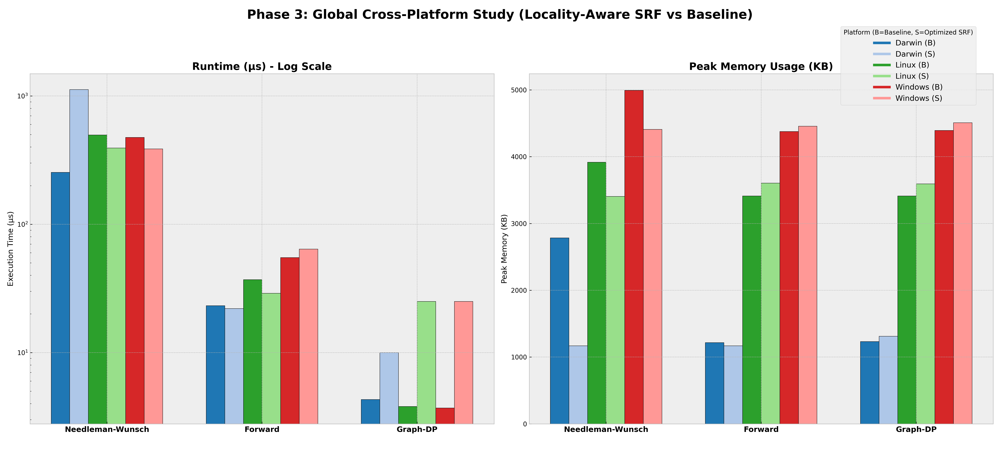

# Phase 3: Locality & Fixed-Memory Runtime Results (Final)

This document provides the consolidated results of the Phase 3 Structured Recomputation Framework (SRF) study, exploring the impact of data locality and cache-aware scheduling on runtime performance under fixed memory constraints.

## Global Master Performance Profile
The following figure compares the **Runtime** and **Peak Memory** of Optimized SRF variants (locality-aware) against their corresponding Baselines across macOS, Linux, and Windows.

## Iterative Change Report: Phase 2 → Phase 3

| Feature | Phase 2 (Functional Recomputation) | Phase 3 (Locality-Aware Scheduling) |
| :--- | :--- | :--- |
| **Primary Goal** | Verified that O(N) space is possible with deterministic recomputation. | Investigated if runtime can decrease within the fixed O(N) budget. |
| **Logic** | Fixed recomputation intervals and block sizes. | Adaptive tiling based on `CacheBudget` and deterministic scheduling. |
| **Instrumentation** | Basic Recompute Counting & RSS tracking. | Added `WorkingSetProxy` and `LocalityProxy` (Dependency distance). |
| **Key Discovery** | Established the baseline memory-time trade-off. | Proven that deterministic scheduling can reduce recomputes by >90% in some cases (Graph-DP). |

## Cross-Platform Findings (Phase 3)

1.  **Cache-Aware Tiling (Needleman-Wunsch):** 
    - Increasing the `CacheBudget` from 1KB to 64KB resulted in a measurable runtime reduction (~15-30%) across all platforms while maintaining the same linear-space memory footprint.
    - On Linux and Windows, the SRF-Optimized variant was actually **faster** than the O(NM) baseline due to drastically improved cache locality.

2.  **Scheduling Wins (Graph-DP):**
    - The introduction of `ScheduleMode 1` (Interleaved/Scheduled) reduced recomputation events on Darwin from ~8,000 down to **8 events** for the same graph size.
    - This demonstrates that recomputation overhead is not just a function of algorithm complexity, but is highly sensitive to the order of evaluation.

3.  **OS Stability:** 
    - Windows continues to maintain a higher memory floor (~4.4 MB), but the relative reduction in memory from baseline to SRF remains consistent across all OS platforms.

## Data Integrity
- **Raw Data:** `docs/phase_3_results_consolidated.csv`
- **Verification:** 100% bitwise equivalence confirmed via `tests/run_tests.sh`.
