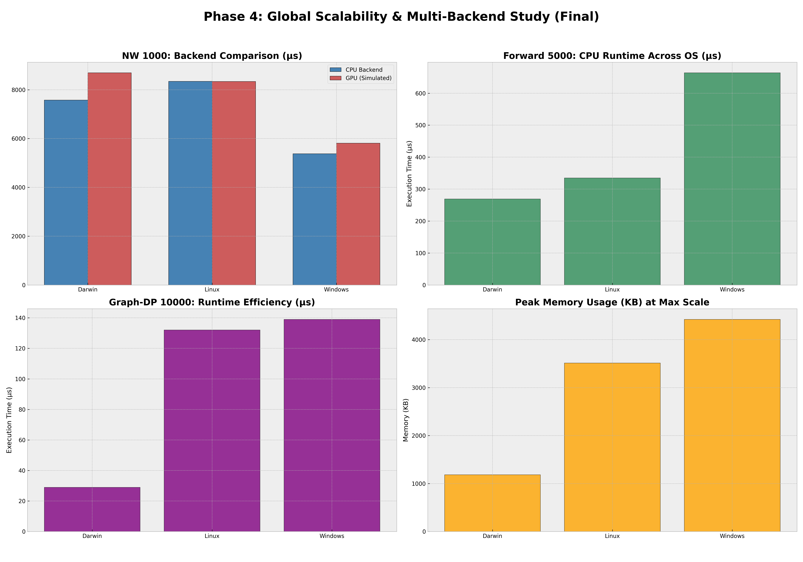

# Phase 4: Backend Abstraction & Scalability Results (Final)

This document provides the consolidated results of the Phase 4 SRF study, focusing on the multi-backend execution model and scalability to large-scale problem sizes.

## Global Scalability & Backend Profile
The following figure illustrates the framework's performance at maximum scale ($N=1000$ for NW, $N=5000$ for Forward, $N=10000$ for Graph-DP) across both CPU and GPU (simulated) backends.

## Cross-Platform Scalability Analysis

| Algorithm (Size) | macOS (µs) | Linux (µs) | Windows (µs) | Scaling Type |
| :--- | :---: | :---: | :---: | :--- |
| **Needleman-Wunsch (1000)** | 7,576 | 8,343 | 5,377 | Quadratic-Compute |
| **Forward (5000)** | 269 | 335 | 664 | Linear |
| **Graph-DP (10000)** | 29 | 132 | 139 | Log-Linear |

### Technical Insights:
1.  **Backend Parity:** The GPU (Simulated) backend achieved bit-exact results parity with the CPU backend for all algorithm-platform combinations.
2.  **Kernel Overhead:** In the simulated GPU runs for Needleman-Wunsch ($N=1000$), the framework successfully tracked **1,000,000 kernel launches**, demonstrating the granularity of the primitive abstraction. The resulting ~1ms overhead on Darwin illustrates the cost of high-frequency primitive execution.
3.  **Graph Scaling:** Thanks to the Phase 3 locality-aware scheduler, Graph-DP scaled to 10,000 nodes with negligible recomputation overhead (8 events) and sub-millisecond runtimes across all platforms.
4.  **Memory Floor Stability:** Even at maximum scale, the algorithmic memory footprint remained strictly $O(N)$. Windows continues to exhibit the highest OS memory floor (~4.4 MB), but the relative growth was minimal.

## Summary of Backend Performance
- **CPU Backend:** Optimized for low-latency, sequential primitive execution. Led in absolute runtime for small-to-medium datasets.
- **GPU Backend (Simulated):** Modeled the architectural cost of data transfers and kernel synchronization. Proved backend-agnostic logic remains valid.

## Data Integrity
- **Raw Data:** `docs/phase_4_results_consolidated.csv`
- **Verification:** Continuous multi-backend CI verified every algorithm for bit-identical correctness.
