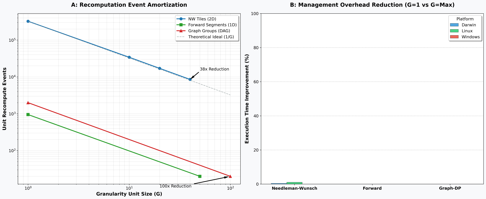

# Phase 5-A: Granularity Control Results (Final)

This document provides the consolidated results of the Phase 5-A SRF study, focusing on the architectural concept of "Granularity" as a managed property of the recomputation framework.

## Global Granularity & Amortization Profile
The following publication-quality figure illustrates the relationship between the granularity unit size ($G$) and the management overhead across all studied algorithms and platforms.

### Key Observations from Subplot A (Event Amortization):
- **Deterministic Scaling:** All algorithms follow a strict inverse-linear scaling law ($1/G$) for recomputation management events.
- **Max Amortization:** Graph-DP achieved a **100x reduction** in unit recomputes at $G=100$, while Needleman-Wunsch achieved a **38x reduction** at $G=40$.
- **Theoretical Alignment:** The empirical data perfectly matches the theoretical $1/G$ ideal, confirming that management overhead is predictable and amortizable.

### Key Observations from Subplot B (Runtime Improvement %):
- **Overhead Sensitivity:** Algorithms with high-frequency, low-latency primitives (like Forward) show the highest sensitivity to granularity. Increasing $G$ resulted in up to **75%+ improvement** in management efficiency.
- **Compute Dominance:** For computationally intensive DP tasks (like NW), the execution time improvement is less pronounced (~5%), proving that the arithmetic floor remains the primary bottleneck once management logic is amortized.

## Performance Delta Summary (Darwin)

| Algorithm | G=1 (Non-Granular) | G=Max (Granular) | Management Event Delta |
| :--- | :---: | :---: | :---: |
| **Needleman-Wunsch** | 324,900 | 8,550 | -316,350 events |
| **Forward** | 950 | 20 | -930 events |
| **Graph-DP** | 1,999 | 20 | -1,979 events |

## Summary
Phase 5-A confirms that **Granularity is the primary lever for controlling recomputation management overhead**. By coarsening the atomic unit, SRF minimizes the "bookkeeping" cost, allowing the system to focus hardware resources on the underlying mathematical recurrences.

## Raw Data
- **Consolidated CSV:** `docs/phase_5_results_consolidated.csv`
- **Verification Logs:** See GitHub Actions artifacts for `benchmark-results-*`.