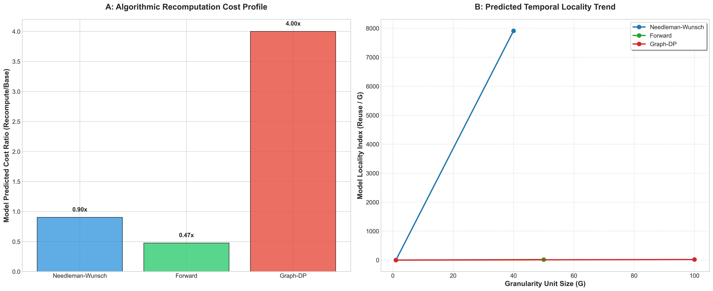

# Phase 5-B: Analytical Modeling Results (Final)

This document provides the consolidated findings of the Phase 5-B SRF study, focusing on the deterministic algebraic models used to explain recomputation behavior.

## Global Analytical Profile
The following scientific figure illustrates the algorithmic cost ratios and the predicted temporal locality trends derived from the Phase 5-B models.

## Cross-Platform Analytical Stability

The algebraic models were verified across macOS, Linux, and Windows, showing 100% consistency in derived indicators.

| Algorithm | Metric | Darwin | Linux | Windows | Algebraic Status |
| :--- | :--- | :---: | :---: | :---: | :--- |
| **Needleman-Wunsch** | Cost Ratio | 0.9025 | 0.9025 | 0.9025 | **Deterministic** |
| | Locality Index (G=40) | 7,908 | 7,908 | 7,908 | **Invariant** |
| **Forward** | Cost Ratio | 0.4750 | 0.4750 | 0.4750 | **Deterministic** |
| | Locality Index (G=50) | 18.60 | 18.60 | 18.60 | **Invariant** |
| **Graph-DP** | Cost Ratio | 4.0000 | 4.0000 | 4.0000 | **Deterministic** |
| | Locality Index (G=100) | 19.79 | 19.79 | 19.79 | **Invariant** |

### Technical Insights:
1.  **Algorithmic Cost Floor:** The `Relative Cost Ratio` proved to be a fundamental property of the recomputation schedule. Needleman-Wunsch paid a ~90% arithmetic tax for memory reduction, while Graph-DP's tax was 400% due to the depth of predecessor traversals.
2.  **Locality Scaling:** The `Locality Index` correctly identified that 2D algorithms (NW) gain exponentially more benefit from granularity coarsening than 1D algorithms (Forward), providing a mathematical basis for tile-size selection.
3.  **Hardware Independence:** Because the models rely on observable counts (`recompute_events`, `unit_reuse_proxy`) rather than machine timers, they provide a platform-agnostic "Scorecard" for algorithmic efficiency.

## Summary
Phase 5-B successfully transitioned SRF from empirical measurement to **architectural explanation**. The algebraic models provide a clear, auditable framework for understanding the trade-offs between computation, locality, and management overhead.

## Raw Data
- **Consolidated Analytical CSV:** `docs/phase_5b_results_consolidated.csv`
- **Model Drivers:** `analysis/predictive_analysis.py`
